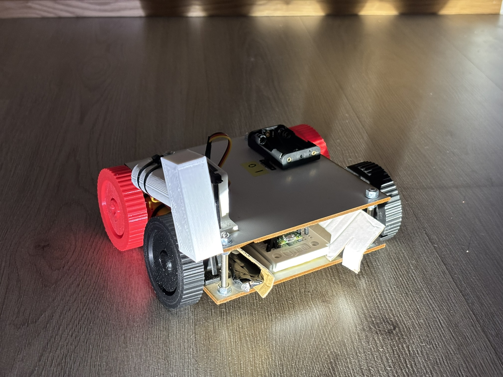

# Principles-of-Digital-Fabrication
## Group 23
### Violent light-chasing alarm clock



---

### Contents of the repository:

```
cad:
    -stl-files of the 3D-printed components

pico:
    dev:
        -collection of Python-scripts tested with Pico (including the final "main_final.py")
        -micropython firmware for Pico (.uf2)
        -schematic as a pptx- and jpeg-file
  
    docs:
        -documentations and datasheets of the used components
  
    experiments:
        -pictures and videos of the design/building process and testing

sketches:
    -some sketches and ideation from early phase of the design

-materials.xlsx (the materials&components list including costs and specifications)

-README.md (this file)
```